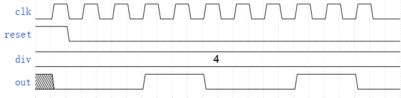

# 可变分频器

## 题目描述

请设计一个由div信号控制的可变分频器，分频比为（div+1），其中div的范围为0~31。

当（div+1）为偶数时，前（div+1）/2个时钟周期，out输出为低电平，后（div+1）/2个时钟周期为高电平，然后循环。 当（div+1）为奇数时，前（div+2）/2个时钟周期，out输出为低电平，后div/2个时钟周期为高电平，然后循环。

使用同步复位，在时钟到来时，如果reset信号为高电平，内部计数器复位，out输出为低电平。

具体时序，可以参考下图。



## 输入格式

- `clk`: 1bit
- `reset`: 1bit
- `div[4:0]`: 4bit

## 输出格式

- `out`: 1bit

## 代码编辑

```verilog
module divider (
    input clk,
    input reset,     
    input [4:0] div,
    output out
);
    // 在这里输入你的代码 请不要修改模块和信号名称
endmodule
```